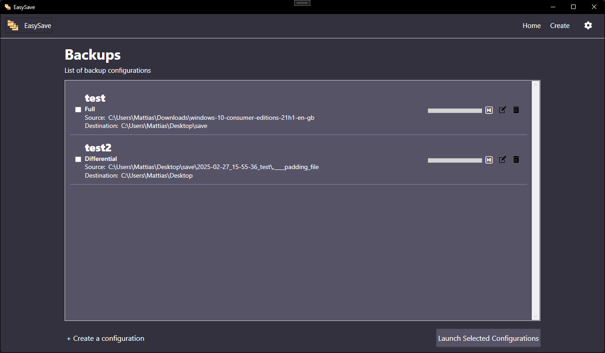
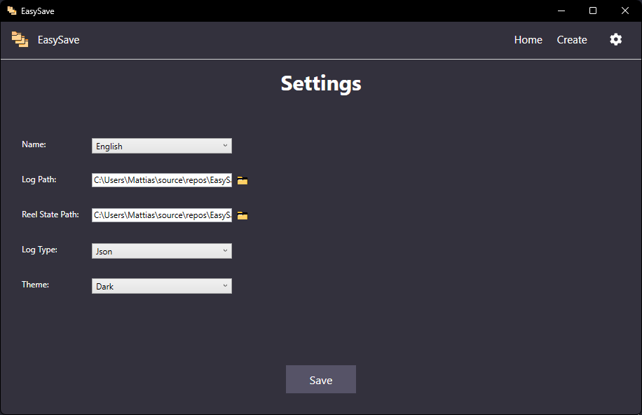

# EasySave

[](https://github.com/MattiasGervilliers/EasySave/blob/main/README.md)
[](https://github.com/MattiasGervilliers/EasySave/blob/main/README.fr.md)

## Description

EasySave is a console application designed to perform file and folder backups simply and efficiently.



### Main Features:

- Create and execute backup jobs.
- Two types of backups available: full and differential.
- Ability to execute one or multiple backups via command-line arguments or using the graphics version.
- Backup files from local drives, external drives, or network drives.
- Automatically generates daily logs and a real-time status file.

## Usage

Launch the application and configure your backups using the graphics interface.

#### Or

Run a backup via the command line:

```sh
console.exe 1      # Executes backup No. 1.
console.exe 1-3    # Executes backups 1, 2, and 3.
console.exe 1;3    # Executes backups 1 and 3.
```

## Configuration

### Graphic Interface

The graphic interface and the console mode allows you to change your settings like the log path, real-time status path, and log format (XML or JSON).



You can also edit the `settings.json` file directly.
The `settings.json` file allows you to modify application settings, including the log path, real-time status path, and log format (XML or JSON).

### Example of `settings.json` file:

```json
{
  "Language": 1,
  "LogPath": "C:\\Chemin\\Vers\\Les\\Logs",
  "StatePath": "C:\\Chemin\\Vers\\Etat\\Temps\\Reel",
  "LogFormat": 1,
  "Configurations": [
    {
      "Name": "Sauvegarde1",
      "SourcePath": "C:\\Source",
      "DestinationPath": "C:\\Destination",
      "BackupType": 0
    }
  ],
  "Theme": 0,
  "ExtensionPriority": [
    ".txt",
    ".pdf"
  ],
  "BusinessSoftwareList": [
    "CalculatorApp",
    "msedge"
  ]
}
```

- **Language** : Sets the application's language (0 = French, 1 = English). Default: `1`.
- **LogPath** : Defines the location of log files. Default: `C:\\Chemin\\De\\EasySave\\Logs`.
- **StatePath** : Defines the location of the real-time status file. Default: `C:\\Chemin\\De\\EasySave\\Logs\\state.json`.
- **LogFormat** : Defines the log file format (0 = JSON, 1 = XML). Default: `0`.
- **Configurations** : List of configured backups.
- **Theme** : Sets the application's theme (0 = Light, 1 = Dark). Default: `0`.
- **ExtensionPriority** : List of file extensions to prioritize during backups. Default: `[".txt", ".pdf"]`.
- **BusinessSoftwareList** : List of business software to close before starting a backup. Default: `["CalculatorApp", "msedge"]`.

## Logs and Real-Time State

### Daily Logs

Each backup action is recorded in a daily log file in XML or JSON format named `log_yearmonthday`, including:

- Date and time of the action
- Backup name
- Source and destination file paths
- File size
- Transfer time (negative in case of failure)

### Real time State

A `state.json` file is updated in real time with:

- The name of the ongoing backup
- The timestamp of the last executed action
- The backup status (Completed, Active)
- The number of transferable files
- The total size of files to be backed up (in bytes)
- The number of remaining files to be backed up
- The source path of the currently backing-up file
- The destination path of the currently backing-up file